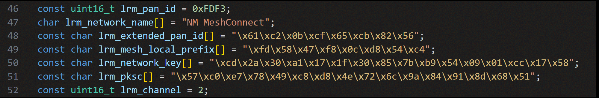
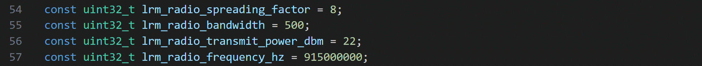
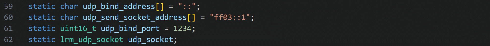
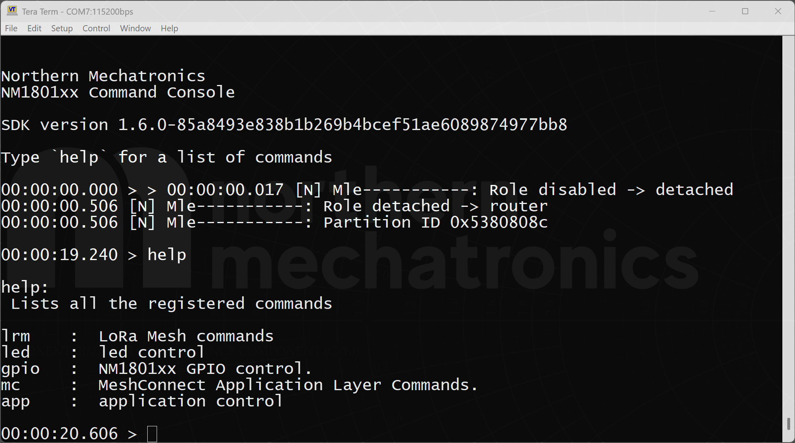
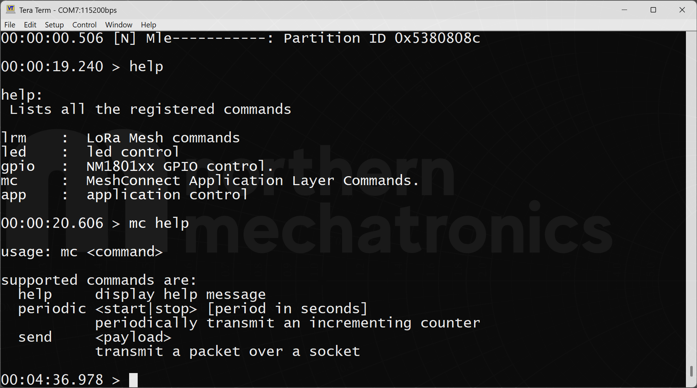
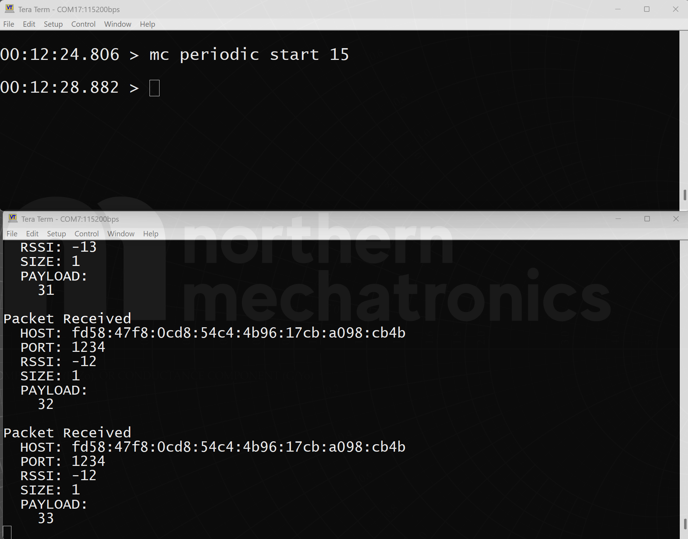
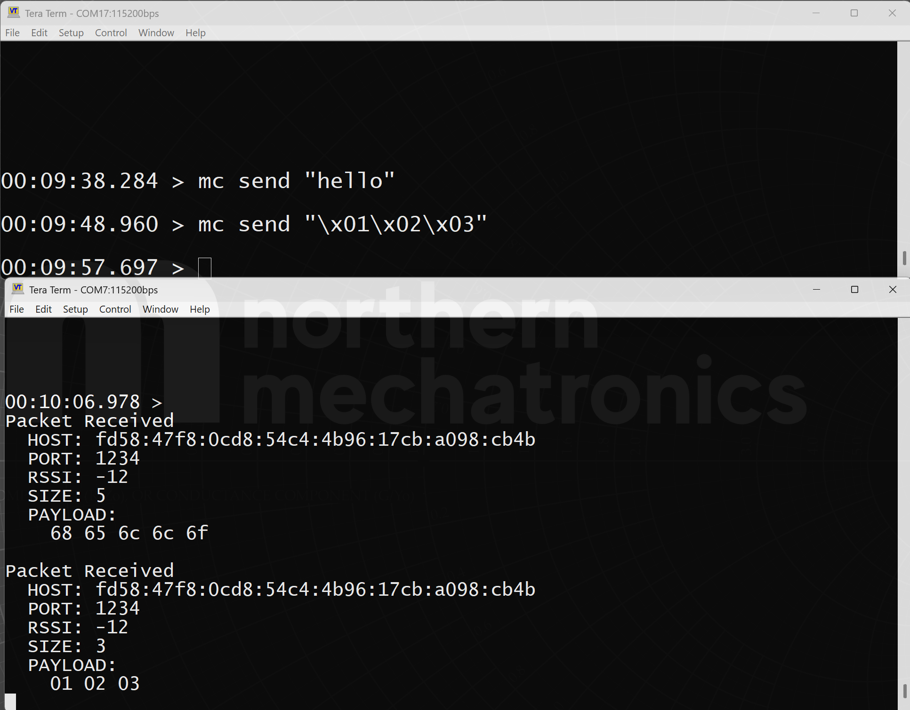

# MeshConnect Getting Started

This example demonstrate the basic operation of MeshConnect including network instantiation and
mesh multicast communication. At least two boards are required to demonstrate send and receive.
Demonstration of hopping requires three or more boards.

**⚠ WARNING ⚠**: Change the radio parameters prior to running this example.
*Default communication occurs in the 900MHz ISM band for use in North America.
*This frequency may be
restricted in other regions.

## Hardware Requirements

- Two or more Northern Mechatronics development board (NM180100EVB, NM18041x) _or_ user designed boards with a NM1801xx target and an SWD port exposed
- USB cable (for NMI development boards with DAPLink onboard) _or_ Segger J-Link

## Software Requirements

- Microsoft Visual Studio Code
- Software prerequisites (see our [Getting Started](doc/getting_started.md) guide for details)

## Build the Application

For instructions on how to build this reference application and flash the binary to the NM1801XX, follow along step-by-step in the [Getting Started](doc/getting_started.md) guide.

## Regional Settings

**⚠ WARNING ⚠**: In the file `application_lrm.c`, adjust the following parameters to ensure compliance with your local laws:

- lrm_radio_transmit_power_dbm
- lrm_radio_frequench_hz

## Quick Start

The application is designed to automatically instantiate a network (if no
existing network is found) or join an existing network out of the box. Once
`LED0` stops breathing and starts to blink, the device is ready for communication.
The green LED `LORA_TX` indicates there is a transmit.

A short press of button `BTN_0` will initiate a send.
Upon receive, `LED4` will blink once to indicate a packet has been received.

## MeshConnect Description

### Protocol Stack API

The application firmware interacts with the MeshConnect protocol stack with the
API defined in `lrm_api.h` located in `nmsdk2/targets/nm1801xx/common/lora_mesh/include`.

`lrm_task` implemented in `lrm_task.c` handles all the transport layer (OSI
layer 4) operations and application layer callback execution.

### MeshConnect Setup

Network and radio setup are implemented in `application_lrm.c`. There are three steps to initialize MeshConnect:

1. Define the network configuration.
2. Configure radio physical parameters.
3. Configure communication socket parameters.

#### Step 1: Configure the MeshConnect Network

For ease of demonstration, the application hardcodes all the parameters needed
to allow devices to immediately start and join into a network when powered on.
These parameters are defined in the `lrm_config` structure.

As detailed in the `lrm_network_configure` function, the parameters used in this
application are defined from line 46 to 52 of `application_lrm.c`.

In a production application, the network parameters should reside in the
secured memory region of the NM1801xx. These parameters can be programmed either
at manufacturing or over BLE at the time of deployment.

#### Step 2: Configure the Radio

Radio parameters are defined from line 54 to line 57 of `application_lrm.c`. Adjust the
parameters based to comply with local laws.

#### Step 3: UDP Muticast Setup

Finally, adjust the socket bind address which is the sent address that a node should be listening to. In this example,
`::` is used meaning that it will respond to packets sent from any addresses within the mesh network.

### Command Line Interfaces

This application includes a command line interface (CLI) over VCOM or RTT for
the user to directly control MeshConnect communications.

Connect the EVB or the Petal Development Board to the host computer via serial
terminal to access the CLI. For a list of supported commands and usage, type
help at the command prompt.

Two sets of commands were implemented: `lrm` and `mc`. `lrm` commands expose
lower layer control and query of the MeshConnect stack. It is meant for
diagnostics purposes. `mc` commands provide application layer interaction.

Two `mc` subcommands were implemented. They are `mc periodic` and `mc send`.
`mc periodic` allows a user to periodically transmit an incrementing counter
formatted in string.

`mc send` allows the user to send text or binary string.

## MeshConnect Session Context

The MeshConnect stack uses the on-chip flash to store the session context. By
default, two pages are used from the 4th last page of the flash region.
Please reach out to Northern Mechatronics if customisation is required.

**⚠ WARNING ⚠**: For applications that make use of all radio access technologies
simultaneously (BLE, LoRaWAN, MeshConnect), adjust the addresses of the session context of BLE
and LoRaWAN to ensure no address collisions occur between the different protocol stacks.
All BLE, LoRaWAN, and MeshConnect reference applications had the default session context addresses
defined at different offsets to avoid collisions.
